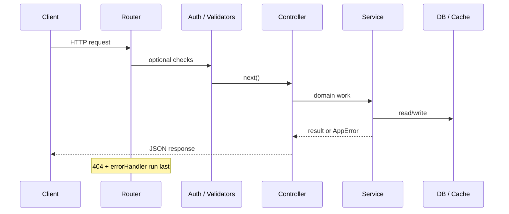

# SumItUp Architecture

This document describes how the backend and frontend are organized, and which principles we follow.

## Layered backend

```
HTTP Request
    → Routes (path + method only)
    → Middleware (auth, validation, rate limits)
    → Controllers (HTTP status codes, JSON shape)
    → Services (business rules, caching, external I/O)
    → Utils / Models (algorithms, persistence)
```

### SOLID mapping

| Principle | How we apply it |
|-----------|------------------|
| **S** Single Responsibility | Controllers do not embed summarization algorithms; `TextSummarizationService` owns text summary + cache keys. |
| **O** Open/Closed | New content types add a controller + optional extractor service without changing the text summarizer. |
| **L** Liskov | Shared response helpers and `AppError` behave consistently across handlers. |
| **I** Interface Segregation | Small focused modules (`safeUrl`, `uploadPaths`) instead of one giant util file. |
| **D** Dependency Inversion | Controllers depend on services; services depend on abstractions (cache interface via `CacheService`). |

### Patterns in use

- **Cache-aside** — `CacheService.getOrSet` for repeated text summaries.  
- **Middleware pipeline** — Express chain for cross-cutting concerns.  
- **Repository-style models** — Mongoose models for User, Content, UserPreferences.  
- **Factory-style route registration** — One router per domain (`auth`, `summary`, `content`).

## Request lifecycle



## Frontend architecture

- **Container screens** — Upload and Summary screens call `api.ts`.  
- **Auth context** — Global session; avoids prop drilling.  
- **Navigation** — Typed stack params for content type on upload.

Accessibility: interactive elements should expose `accessibilityRole`, `accessibilityLabel`, and sufficient color contrast (see WCAG 2.1 AA targets in `PRODUCT_ROADMAP.md`).

## Performance notes

- Summarization is CPU-bound for NLP; cache stable inputs by content hash.  
- Prefer streaming/async file reads for large PDFs over loading entire files when scaling.  
- Rate limits protect against abuse on auth and global API.  
- Mobile: use `FlatList` for long history lists; avoid re-fetching on every focus without stale-time policy.

## Security boundaries

- JWT required on sensitive routes (summary, files, content, user).  
- URL fetch only after `assertSafePublicUrl` (blocks localhost, private IPs, non-http(s)).  
- Upload filenames resolved under a single uploads root (`resolveUploadPath`).  
- Production errors return generic messages; details logged server-side only.
