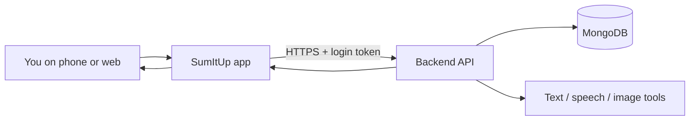

# SumItUp — Plain-Language Project Guide

## What is SumItUp?

SumItUp is a mobile app (built with React Native and Expo) plus a backend API that turns **long content into short summaries**. You can send in things like:

- A voice recording or audio file  
- A photo or GIF  
- A video  
- A PDF  
- A web page URL  

The backend extracts or transcribes text, runs it through a summarization engine, and returns a shorter version you can read in the app. You can sign up, log in, save history, earn “tokens” by watching ads, and tune preferences such as summary length and style.

Think of it as **“read the highlights without reading everything.”**

---

## Who is it for?

- Students and professionals who need quick takeaways from articles, PDFs, or lectures  
- Anyone who saves links or documents but rarely has time to read them fully  
- Mobile-first users who want summaries on the go  

---

## How the pieces fit together

1. **App (frontend)** — Screens for login, home, upload, summary, history, and profile. It talks to the API over HTTP and stores your login token locally.  
2. **API (backend)** — An Express.js server that validates requests, runs summarization, manages users, files, tokens, and search.  
3. **Database** — MongoDB stores users, saved summaries (content), preferences, and file metadata.  
4. **Processing** — Libraries for NLP (`natural`), speech (e.g. DeepSpeech / AssemblyAI paths), OCR/vision for images, PDF parsing, and web scraping for URLs.

There is also an **in-memory cache** (NodeCache) to avoid repeating expensive work for the same input when caching is wired in.

---

## Main user journeys

### Sign up and log in

You create an account with email and password. The server hashes your password, can send verification email, and issues a **JWT** (JSON Web Token) on login. The app sends that token on protected requests in the `Authorization` header.

### Pick a content type and summarize

On the home screen you choose Audio, Video, PDF, URL, Image, or GIF. The upload screen collects a file or URL and calls the matching API route under `/api/summary/generate/...`. The server validates input, processes the content, and returns `{ summary: "..." }`.

### History, favorites, and search

Processed items can be saved to **content history**, marked as favorites, tagged, and searched (see `/api/content` and `/api/search`).

### Tokens and ads

Users can **earn tokens** (e.g. after ads) and spend them for perks such as an ad-free experience. Eligibility and balances live on the user record and related endpoints.

---

## Backend structure (simplified)

| Area | Role |
|------|------|
| `index.ts` | Starts the server, security middleware, routes |
| `src/routes/` | URL paths grouped by feature (auth, summary, file, content, …) |
| `src/controllers/` | HTTP layer: read request, call services, send response |
| `src/services/` | Business logic (auth helpers, PDF, image summary, text pipeline) |
| `src/models/` | MongoDB schemas (User, Content, UserPreferences) |
| `src/middleware/` | Auth, validation, centralized errors |
| `src/utils/` | Audio, text, image helpers |
| `tests/unit/` | Automated tests for controllers, models, services |

**Design goal:** routes stay thin; controllers orchestrate; services hold reusable logic (Single Responsibility, easier testing).

---

## Frontend structure (simplified)

| Area | Role |
|------|------|
| `App.tsx` | Auth provider + navigation shell |
| `src/navigator/` | Stack/tabs and screen names |
| `src/screens/` | Login, signup, home, upload, summary, history, profile |
| `src/context/AuthContext.tsx` | Login state and token storage |
| `src/services/api.ts` | Axios client and API calls |

---

## Running locally (short version)

1. Install **Node.js 18+** and **MongoDB**.  
2. **Backend:** `cd backend`, copy `.env.example` to `.env`, set `MONGODB_URI` and `JWT_SECRET`, then `npm install` and `npm start`.  
3. **Frontend:** `cd frontend`, `npm install`, `npm start`, then open in Expo Go or a simulator.  
4. **Tests (backend + frontend):** from repo root, `nvm use && npm run install:all && npm run test:unit` (requires Node 20 from `.nvmrc`).
5. **Coverage (≥80% gate):** `npm run test:coverage`.
5. **Run everything locally (MongoDB + API + Expo):** `nvm use && npm run install:all && npm run dev` (requires Docker). Stop DB with `npm run dev:stop`.  
5. **API docs:** With the server running, open `/api/docs` (Swagger).

See the root [README](../README.md) for full environment variables and endpoint tables.

---

## Security and quality (what we care about)

- **Helmet**, **CORS**, and **rate limiting** on the API  
- **Password hashing** (bcrypt) and **JWT** for sessions  
- **Input validation** on auth routes; file type and size limits on uploads  
- **SSRF protection** on URL summarization (only safe public HTTP(S) URLs)  
- **Central error handler** so failures do not leak stack traces in production  

---

## Where to read more

- [Architecture and patterns](./ARCHITECTURE.md) — how we organize code and apply SOLID  
- [Product roadmap & UX ideas](./PRODUCT_ROADMAP.md) — features for a production-ready app  
- [Backend API](../backend/API_DOCUMENTATION.md) — endpoint reference  

---

## Glossary

| Term | Meaning |
|------|---------|
| **JWT** | Signed token proving you are logged in |
| **Summarization** | Picking the most important sentences from longer text |
| **OCR** | Getting text from images |
| **ASR** | Speech-to-text from audio |
| **Token (in-app)** | Virtual currency for rewards / ad-free use, not blockchain |
